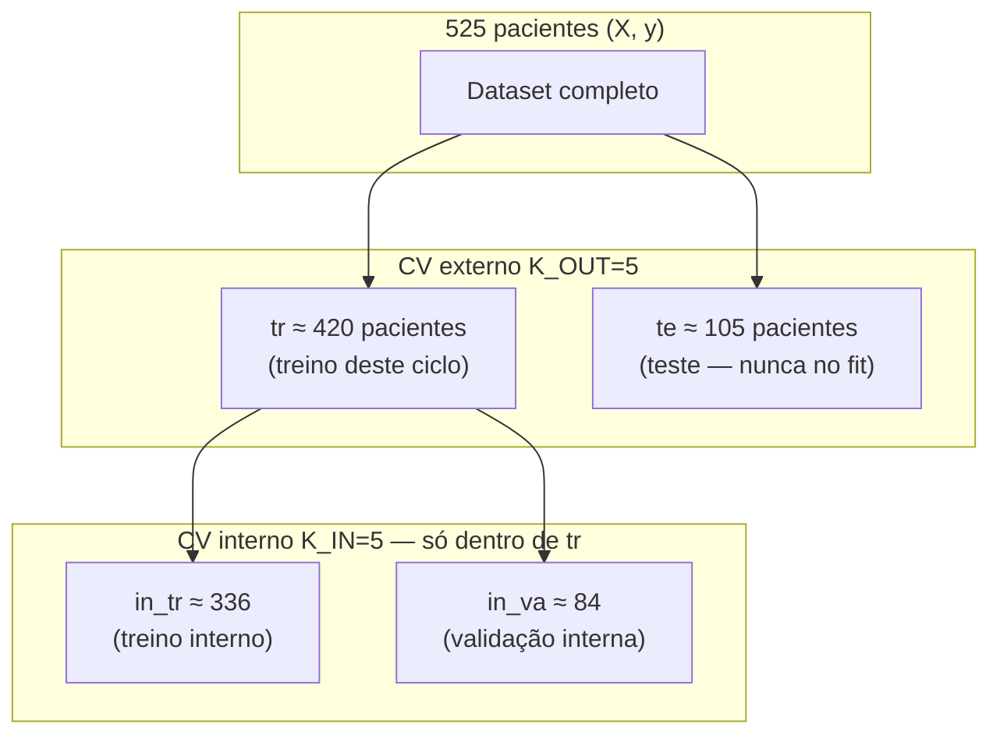

# Protocolo de validação cruzada aninhada (nested CV)

Documentação do fluxo implementado em `experimentos.ipynb` (`nested_cv_patient_level`) para os **testes 1 e 2** (525 pacientes, 1 linha por paciente).

**Dados de referência:** 397 sMCI (classe 0), 128 pMCI (classe 1) — ~76% / ~24%.

**Hiperparâmetros fixos no código:** `K_OUT = K_IN = 5`, `SEED = 42`, `C_GRID = [1e-3, 0.01, 0.1, 1.0, 10.0]`.

---

## Visão geral: dois níveis de CV



| Nível | Função | Usa o conjunto de teste externo `te`? |
|-------|--------|--------------------------------------|
| **Externo** | Escolher `best_C`, treinar modelo final, métricas da tabela (AUC, MCC, …) | `te` só para **avaliar** (transform + predict) |
| **Interno** | Para cada `C`, estimar AUC em validação interna | **Não** |

**Importante:** em cada fold externo, cada paciente está **ou** em `tr` **ou** em `te` (nunca nos dois). Soma: **420 + 105 = 525**.

Ao longo dos **5 folds externos**, cada paciente entra em `te` **exatamente uma vez** (5 × 105 = 525).

---

## Tamanhos típicos por fold (StratifiedKFold)

Com `SEED = 42` e estratificação por `y`, as contagens são estáveis; sMCI/pMCI variam ±1 entre folds.

| Conjunto | Pacientes | sMCI (≈) | pMCI (≈) | Papel |
|----------|-----------|----------|----------|--------|
| **te** (teste externo) | **105** | **79** | **26** | Avaliação final; **sem** balanceamento |
| **tr** (treino externo bruto) | **420** | **318** | **102** | Base para CV interno + treino final |
| **tr balanceado** (`bal`) | **204** | **102** | **102** | Treino final do SVM após escolher `C` |
| **in_va** (validação interna, 1 de 5) | **84** | **63** | **21** | AUC interna; **sem** balanceamento |
| **in_tr** (treino interno bruto) | **336** | **255** | **81** | Base do inner |
| **in_tr balanceado** | **162** | **81** | **81** | `fit` do SVM no loop interno |

### Exemplo numérico — fold externo 1 (`SEED = 42`)

- **te:** 105 pacientes (79 sMCI, 26 pMCI)
- **tr:** 420 pacientes (318 sMCI, 102 pMCI)
- **bal** (treino final): 204 (102 + 102)
- **Inner fold 1:** `in_va` 84 | `in_tr` 336 → após balancear `in_tr`: **162**

---

## Onde cada etapa é aplicada

Há **dois contextos**: loop **interno** (escolha de `C`) e passo **externo final** (métricas reportadas).

### A) Loop interno (dentro de `tr`)

Para cada `C` em `C_GRID` e cada par `(in_tr, in_va)` do `StratifiedKFold` interno:

| Ordem | Etapa | Função / código | Dados |
|-------|--------|-------------------|--------|
| 1 | Seleção de atributos | `feature_keep(X[tr][in_tr], …)` | Só **in_tr** (~336 pacientes) |
| 2 | Máscara de colunas | `apply_column_mask` | Mesmo `keep` em treino e val interna |
| 3 | Balanceamento | `downsample_patient_indices(in_tr, y[tr], …)` | Só **in_tr** → ~162 pacientes |
| 4 | Z-score | `scale_train_val(X_fit, X_va)` | `fit` em treino balanceado; `transform` em **in_va** |
| 5 | SVM | `clf(C).fit(X_fit_z, y[tr][bal])` | Treino ~162 |
| 6 | Avaliação | `decision_function(X_va_z)` | Val interna ~84, **desbalanceada** |

- Repetido **5 × 5 = 25** treinos SVM por fold externo.
- Média das AUCs dos 5 inners → compara candidatos `C`; o melhor vira `best_C`.

**`te` e `in_va` nunca entram no `fit` de seleção, scaler ou balanceamento.**

### B) Fold externo final (após escolher `best_C`)

| Ordem | Etapa | Dados |
|-------|--------|--------|
| 1 | `feature_keep(X[tr], …)` | **Novo** `keep` nos 420 de `tr` (não reutiliza o do inner) |
| 2 | `downsample_patient_indices(tr, y, …)` | **204** pacientes (102 sMCI + 102 pMCI) |
| 3 | `scale_train_val(X_fit, X_te_sel)` | `fit` nos 204; `transform` nos **105** de `te` |
| 4 | `clf(best_C).fit(X_fit_z, y[bal])` | Treino final |
| 5 | Métricas | `y[te]`, `scores`, `pred` — teste **desbalanceado** (~79/26) |

---

## Diagrama de um fold externo

```text
525 pacientes
├── te (105) ─────────────────────────────► keep + z-score (transform) + predict + métricas
└── tr (420)
    ├── [INNER: 5 folds × 5 valores de C]
    │     in_tr (336) → feature_keep → downsample → 162 → z-score (fit)
    │     in_va (84)  → mesma keep → z-score (transform) → AUC → escolhe C
    └── [OUTER FINAL com best_C]
          tr (420) → feature_keep (de novo) → downsample → 204 → z-score (fit)
          te (105) → mesma keep → z-score (transform) → métricas do fold
```

---

## Quantidade de treinos SVM por execução

| Escopo | Cálculo | Total |
|--------|---------|-------|
| Por fold externo | 5 (C) × 5 (inner) + 1 (final) | **26** |
| Dataset completo (5 folds externos) | 5 × 26 | **130** |

---

## Pré-processamento e flags

| Recurso | Treino | Validação interna | Teste externo |
|---------|--------|-------------------|---------------|
| Correlação + variância (`feature_keep`) | `fit` no treino do split | `transform` (mesmas colunas) | `transform` |
| Balanceamento sMCI/pMCI | Sim | Não | Não |
| Z-score (`StandardScaler`) | `fit` no treino do split | `transform` | `transform` |
| `LinearSVC` | `fit` | — | `predict` / `decision_function` |

- `USE_FEATURE_SELECTION = False` → mantém todas as colunas (ex.: 219 no teste 1, ~13140 no teste 2).
- `USE_FEATURE_SELECTION = True` → corr/var recalculados em **cada** treino de split (inner e outer separados).

---

## O que não acontece (erros comuns)

1. **Não** há 525 pacientes dentro de um único fold de treino: há **420** em `tr` e **105** em `te`.
2. **Não** se reutiliza o `keep` ou o scaler aprendido no inner para o treino final externo.
3. **Não** se balanceia `te` nem `in_va` (proporções reais na avaliação).
4. Os gráficos (`plot_cv_diagnostics`) refletem apenas o **teste externo** de cada fold, não o inner.

---

## Métricas reportadas (por fold externo)

Cada linha da tabela de resultados corresponde a um `te` (~105 pacientes):

| Coluna | Significado |
|--------|-------------|
| `best_C` | Regularização escolhida no CV interno |
| `n_features` | Colunas após seleção (se ativa) |
| `n_train_bal` | Pacientes no treino final balanceado (≈204) |
| `n_test` / `n_test_pMCI` | Tamanho e contagem pMCI em `te` |
| `auc`, `auc_pr` | Discriminação e precisão-recall |
| `bal_acc`, `mcc` | Acurácia balanceada e correlação |
| `sens_pMCI`, `spec_sMCI` | Sensibilidade e especificidade |
| `prec_pMCI`, `f1_pMCI` | Precisão e F1 para pMCI |

O resumo (média ± desvio) agrega os **5 folds externos**.

---

## Referência no código

- Funções: célula **«Funções compartilhadas»** em `experimentos.ipynb`
- Entrada principal: `nested_cv_patient_level(X, y, test_name, collect_fold_details=…)`.
- Teste 1: média das 60 linhas por paciente → `all_features_merge_clean.csv`.
- Teste 2: formato wide temporal → `all_features_patient_wide_temporal.csv`.

---

## Resumo em uma frase

No fold externo, **420 pacientes** passam pelo inner 5×5 (blocos ~336/84, fit em ~162 balanceados com z-score próprio) para escolher **`C`**; em seguida **420 → 204** balanceados com **nova** seleção e z-score treinam o SVM final, e as métricas vêm dos **105** de `te` apenas transformados — sem nunca treinar em `te`.
